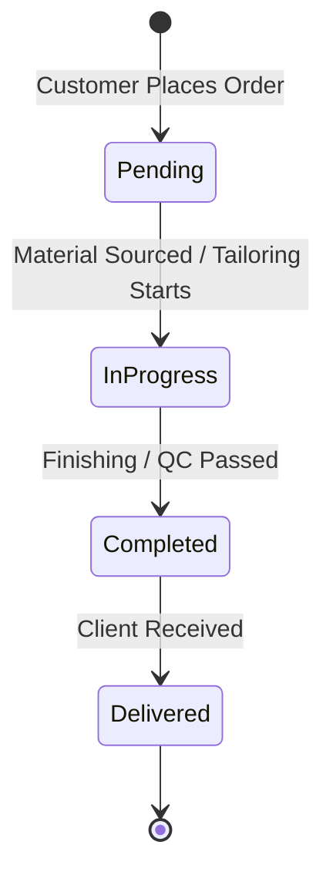
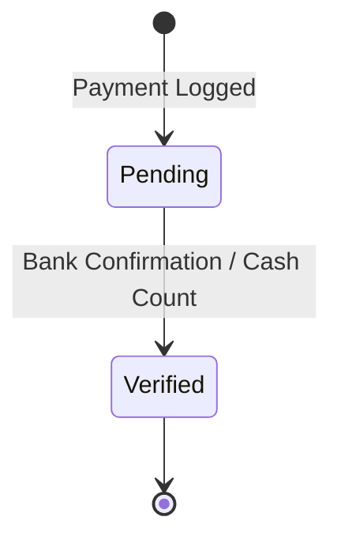

# Backend Architecture & Database Schema

This document outlines the full database schema and state management logic for the Fashion Designer Order Management System. The architecture is designed for a PostgreSQL environment (e.g., Supabase).

## 1. Database Schema (PostgreSQL)

### `customers`
Stores core client identity and contact information.
| Column | Type | Description |
| :--- | :--- | :--- |
| `id` | UUID (PK) | Unique identifier |
| `full_name` | VARCHAR(255) | Full legal name |
| `phone_number`| VARCHAR(20) | Primary contact |
| `address` | TEXT | Primary delivery address |
| `notes` | TEXT | General preferences |
| `loyalty_tier` | VARCHAR(20) | Bronze, Silver, Gold, Platinum |
| `created_at` | TIMESTAMP | Record creation |

### `measurements`
Stores precise anatomical dimensions. Linked to customers.
| Column | Type | Description |
| :--- | :--- | :--- |
| `id` | UUID (PK) | Unique identifier |
| `customer_id` | UUID (FK) | Reference to `customers` |
| `fabric_type` | VARCHAR(50) | Material preference |
| `bust` | DECIMAL(5,2) | Bust/Chest (inches) |
| `waist` | DECIMAL(5,2) | Waist (inches) |
| `hips` | DECIMAL(5,2) | Hips (inches) |
| `shoulder` | DECIMAL(5,2) | Shoulder Width (inches) |
| `length` | DECIMAL(5,2) | Dress/Shirt Length (inches) |
| `neck` | DECIMAL(5,2) | Neck (inches) |
| `sleeve` | DECIMAL(5,2) | Sleeve Length (inches) |
| `inseam` | DECIMAL(5,2) | Inseam Length (inches) |
| `updated_at` | TIMESTAMP | Last measurement date |

### `orders`
Central operational ledger for tailoring requests.
| Column | Type | Description |
| :--- | :--- | :--- |
| `id` | UUID (PK) | Unique identifier |
| `order_number`| VARCHAR(20) | Human-readable (e.g., ORD-1234) |
| `customer_id` | UUID (FK) | Reference to `customers` |
| `items` | JSONB | Array of items, styles, and specific mods |
| `total_amount` | DECIMAL(12,2) | Calculated price |
| `status` | ENUM | Pending, In Progress, Completed, Delivered |
| `deadline` | DATE | Delivery deadline |
| `created_at` | TIMESTAMP | Order placement date |

### `payments`
Financial transaction tracking.
| Column | Type | Description |
| :--- | :--- | :--- |
| `id` | UUID (PK) | Unique identifier |
| `order_id` | UUID (FK) | Reference to `orders` |
| `amount` | DECIMAL(12,2) | Payment amount |
| `method` | ENUM | Cash, Bank Transfer, Debit Card |
| `status` | ENUM | Pending, Verified |
| `transaction_ref`| VARCHAR(100) | Bank reference/Receipt ID |
| `created_at` | TIMESTAMP | Payment date |

---

## 2. Status Transitions & State Machine

### Order Lifecycle

### Payment Lifecycle

---

## 3. Action-State Mapping

| User Action | Triggered Transition | Backend Logic |
| :--- | :--- | :--- |
| **Register Customer** | `CREATE customers` | Initialize loyalty tier as 'Bronze' |
| **Update Measurements**| `UPSERT measurements` | Update `updated_at` timestamp |
| **Create Order** | `CREATE orders` | Generate unique `order_number` |
| **Record Payment** | `CREATE payments` | If `amount >= order.total_amount`, auto-verify |
| **Export Report** | `QUERY aggregations` | Join `orders` + `payments` for ROI |

---

## 4. Analytical Requirements (Reporting)

To support the **Reports Module**, the backend must support the following view logic:
1. **Revenue Growth**: `SUM(amount) GROUP BY date_trunc('month', created_at)`
2. **Delivery Efficiency**: `AVG(deadline - actual_delivery_date)`
3. **Customer LTV**: `SUM(total_amount) GROUP BY customer_id`
