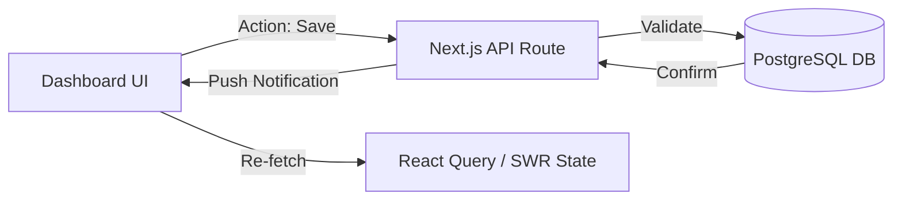

# Dashboard UI to Backend Mapping Schema

This document defines how the visual elements of the **Fashion Designer Dashboard** map to the underlying data architecture.

## 1. Top-Level Metrics (Summary Cards)

| UI Component | Metric | Backend Source / Query |
| :--- | :--- | :--- |
| **Total Orders** | Numeric Count | `SELECT COUNT(*) FROM orders` |
| **Revenue** | Currency Value | `SELECT SUM(amount) FROM payments WHERE status = 'Verified'` |
| **Active Clients** | Numeric Count | `SELECT COUNT(DISTINCT customer_id) FROM orders WHERE status != 'Delivered'` |
| **Pending Tasks** | Numeric Count | `SELECT COUNT(*) FROM orders WHERE status = 'Pending'` |

## 2. Dynamic Charts (Synthesis Logic)

### Revenue Performance (Line/Bar Chart)
- **Data Points**: Monthly totals.
- **Query**: `SELECT date_trunc('month', created_at) AS month, SUM(amount) FROM payments GROUP BY 1 ORDER BY 1`

### Orders by Status (Pie/Status Bar)
- **Data Points**: Percentage distribution.
- **Query**: `SELECT status, COUNT(*) FROM orders GROUP BY status`

### Customer Retention (Donut Chart)
- **Data Points**: New vs. Returning.
- **Logic**: 
    - **Returning**: `COUNT(customer_id)` where customer has > 1 order.
    - **New**: `COUNT(customer_id)` where customer has = 1 order.

## 3. Recent Activity Feed (Event Ledger)

The feed aggregates multiple table events into a unified chronological stream:
| Event Type | Source Table | UI Label |
| :--- | :--- | :--- |
| **New Order** | `orders` | "Order #ORD-XXXX placed by [Customer Name]" |
| **Payment** | `payments` | "Payment of [Amount] verified for [Order #]" |
| **Measurement**| `measurements`| "Dimensions updated for [Customer Name]" |
| **Status Change**| `orders` | "Order #ORD-XXXX moved to [Status]" |

## 4. Search & Filter Logic

### Global Search
- **Input**: Search string.
- **Backend Action**: `SELECT * FROM customers WHERE full_name ILIKE '%query%' OR phone_number LIKE '%query%'`
- **Result Navigation**: Links directly to `customers.id` context in Orders or Measurements.

## 5. State Persistence Flow

## 6. Dashboard Component States

| State | Variable | UI Representation |
| :--- | :--- | :--- |
| **Empty** | `data.length == 0`| "No recent activity found" placeholder |
| **Loading** | `isLoading` | Shimmering glass skeleton screens |
| **Error** | `error != null` | Red-tinted alert card with "Retry Sync" |
| **Success** | `isSuccess` | Data rendered with fade-in animation |
